# School District Analysis

We have been asked to assist a school district's data scientist, Maria, with an analysis of all of the students in the district's high schools standardized test scores for reading and math.

We will help Maria produce a report for the school board which will highlight the following:

- A high-level snapshot of the district's key metrics
- An overview of the key metrics for each school

# Overview of data
## Data about schools in the district
Maria has provided us with two data files we will be utilizing for the project. One the files is a file containing data about all of the schools in the district. This file will contain the following information:

- School ID
- School Name
- Type of School
- Size of School Student Body
- School's Budget

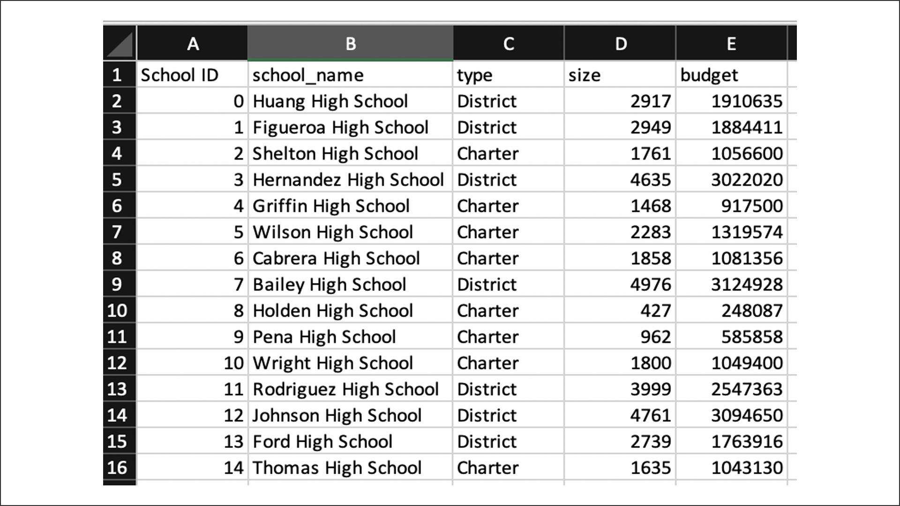

## Data about students in the district
The second file Maria gave us was about every student in the district. The file contains the following information:

- Student ID
- Student's Name
- Student's Gender
- Student's Grade in School
- The Name of the School the Student Attends
- The Student's Reading test Score
- The Student's Math test Score

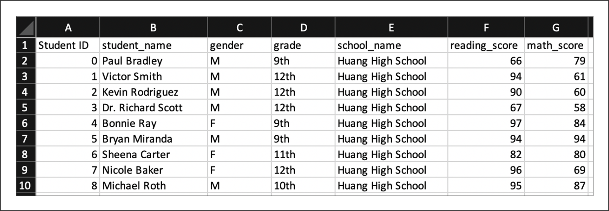

#Overview of Analysis Request

The school board has requested a number of metrics to be produced from the data which will help them look at the following:

<ul>
<li>Performance of each school</li>
<ul>
	<li>By overall average of score for the standardized reading test</li>
	<li>By overall average of score for the standardized math test</li>
	<li>Average score for the standardized reading test by students grade</li>
	<li>Average score for the standardized math test by students grade</li>
</ul>

<li>Comparison of school's performance</li>
<ul>
	<li>School performance based on the budget per student</li>
	<li>School performance based on the school size</li>
	<li>School performance based on the type of school</li>
</ul>
</ul>

#Overview of Analysis Process

After Maria sent us the data files to be analyzed the first thing we had to do was check the data. The data files were opened in Excel to see if there were any obvious problems with the data files.

##Check Data File in Excel

Both files were loaded into Excel. A manual verification was performed in Excel by doing a quick examine of the data file. 

Both files loaded into Excel correctly and the examine of the data revealed that both files seemed to have the appropriate data.

##Cleanse Data

As we inspected the data in Exec, we noticed a number of oddities in the data. Many of the students had prefixes or suffixes on attached to their names.

Some of the things found during our inspection of the student data included:

- Dr. 
- Mr. 
- Ms.
- Mrs. 
- Miss 
- MD
- DDS
- DVM
- PhD

All of these prefixes and suffixes had to be cleansed out of the data before we could start the analysis.

We define the list of bad prefixes and suffixes and the then looped though the list to see if it was attached to a students name. If the term was attached to the student's name the offending term was removed by replacing it with an empty space.

	# Add each prefix and suffix to remove to a list.
	prefixes_suffixes = ["Dr. ", "Mr. ","Ms. ", "Mrs. ", "Miss ", " MD", " DDS", " DVM", " PhD"]
	
	# Iterate through the words in the "prefixes_suffixes" list and replace them with an empty space, "".
	for word in prefixes_suffixes:
	    student_data_df["student_name"] = student_data_df["student_name"].str.replace(word,"")

Now that we had a valid of student names, we could start the data analysis.

##Problem with Thomas High School 9th Grade Data

The school board has notified Maria and her supervisor that the student data file shows evidence of academic dishonesty; specifically, reading and math grades for Thomas High School ninth graders appear to have been altered. Although the school board does not know the full extent of the academic dishonesty, they want to uphold state-testing standards and have turned to Maria for help. She has asked us to replace the math and reading scores for Thomas High School with NaNs while keeping the rest of the data intact. 

The first thing we need to do is remove the reading and math scores for the 9th grade of Thomas High School. By using the loc method we can search for Thomas High School students and the those students in the 9th grade. Once we have identified the correct students we set their reading and math score to NaN.
 
	#  Step 3. Refactor the code in Step 2 to replace the math scores with NaN.
	student_data_df.loc[(student_data_df["school_name"]=="Thomas High School") & (student_data_df["grade"]=="9th"),["math_score"]] = np.NaN
	
	student_data_df.loc[(student_data_df["school_name"]=="Thomas High School") & (student_data_df["grade"]=="9th"),["reading_score"]] = np.NaN

##Affects on Thomas High School's Data

When we look at the scores Thomas high school had before this issue was raised. 

The school district as a whole had a passing percentage of 

 - math test of 73.9% 
 - reading passing percentage of 84.7% 
 - overall passing of both tests of 64.1%.

When we looked at the data for just Thomas High School they had a passing percentage of

- math test of 66.9% 
- reading passing percentage of 66.7% 
- overall passing of both tests of 65.1%.

After removing the 9th grade data, and then recalculating the metrics, without the invalid 9th grade data.

The school district as a whole had a passing percentage of

- math test of 74.8% 
- reading passing percentage of 85.7% 
- overall passing of both tests of 64.9%

When we looked at the data for just Thomas High School they had a passing percentage of 

- math test of 93.2% 
- reading passing percentage of 97.0% 
- overall passing of both tests of 90.6%

The data issue had obvious effects on the following:

For the district

 - percentage of passing math rose nearly 1%
 - percentage of passing reading rose 1%
 - overall passing percentage rose nearly 1%

For Thomas High School

 - percentage of passing math rose nearly 27%
 - percentage of passing reading rose over 31%
 - overall passing percentage rose over 25%

This kind of change is substantial.

## Data Analysis

The first step in helping perform the requested analysis is to analyze each separate school and to see if we can produce school level metrics the school board has requested.

The first task is to combine the the data files we have been given. By utilizing the merge function built in to Pandas we were able to join the two data sets on the school's name.

	# Combine the data into a single dataset
	school_data_complete_df = pd.merge(student_data_df, school_data_df, how="left", on=["school_name", "school_name"])
	school_data_complete_df.head()

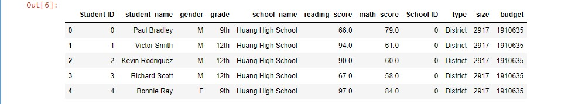

Now that the data set was ready, we could look at some overall metrics.

<ul>
<li>Get the Number of Students, by counting each of the Student IDs in the data set</li>
<li>Get the Number of Schools, by counting the unique school names in the data set</li>
<li>Get the Total Budget, by using the sum function and adding up the budgets for all the schools</li>
</ul>

	# Calculate the Totals (Schools and Students)
	school_count = len(school_data_complete_df["school_name"].unique())
	student_count = school_data_complete_df["Student ID"].count()
	
	# Calculate the Total Budget
	total_budget = school_data_df["budget"].sum()

The next set of metrics we found were the overall average test scores for the standardized reading and math tests.

	# Calculate the Average Scores using the "clean_student_data".
	average_reading_score = school_data_complete_df["reading_score"].mean()
	average_math_score = school_data_complete_df["math_score"].mean()

Then we looked at how many students passed the tests. How many students got a 70 or better on the standardized reading test? How many students got a 70 or better on the standardized math tests?

	# Calculate the passing rates using the "clean_student_data".
	passing_math_count = school_data_complete_df[(school_data_complete_df["math_score"] >= 70)].count()["student_name"]
	passing_reading_count = school_data_complete_df[(school_data_complete_df["reading_score"] >= 70)].count()["student_name"]

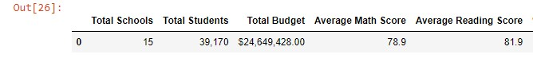

The next task is to find the percentage of students which passed the math test.   

	# Step 3. Calculate the passing percentages with the new total student count.
	passing_math_percentage = passing_math_count / float(new_total_count) * 100
	
	print(f"Passing percentage: {passing_math_percentage:.2f}")
	

The next task is to find the percentage of students which passed the reading test.

	# Calculate the percent that passed reading.
	passing_reading_percentage = passing_reading_count / float(new_total_count) * 100
	
	print(f"Passing percentage: {passing_reading_percentage:.2f}")

The final task is to find the percentage of students which passed the both the reading and the math test.

	# Calculate the students who passed both reading and math.
	passing_math_reading = school_data_complete_df[(school_data_complete_df["math_score"] >= 70)
	                                               & (school_data_complete_df["reading_score"] >= 70)]
	
	# Calculate the number of students that passed both reading and math.
	overall_passing_math_reading_count = passing_math_reading["student_name"].count()
	
	
	# Step 4.Calculate the overall passing percentage with new total student count.
	overall_passing_percentage = overall_passing_math_reading_count / new_total_count * 100

##District level metrics

Once we had of the metrics calculated, we could assemble them into a Pandas Dataframe.

	# Create a DataFrame
	district_summary_df = pd.DataFrame(
	          [{"Total Schools": school_count, 
	          "Total Students": student_count, 
	          "Total Budget": total_budget,
	          "Average Math Score": average_math_score, 
	          "Average Reading Score": average_reading_score,
	          "% Passing Math": passing_math_percentage,
	         "% Passing Reading": passing_reading_percentage,
	        "% Overall Passing": overall_passing_percentage}])
	
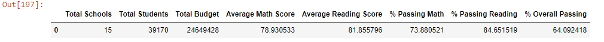

Maria is impressed by your summary DataFrame that our analysis has produced. She requests that we add some formatting to make the DataFrame look more professional and finished. She asked that we add the following to the dataframe: 
<ul>
<li>We need to format the budget to two decimal places</li>
<li>format the grade averages to one decimal place</li> 
<li>grade percentages to the nearest whole number percent</li>
<li>add a thousands separator for numbers greater than 1,000.</li>
</ul>

	# Format the "Total Students" to have the comma for a thousands separator.
	district_summary_df["Total Students"] = district_summary_df["Total Students"].map("{:,}".format)
	
	# Display the data frame
	district_summary_df

After formatting all of the columns utilizing the map function of the dataframe, the output for the district metrics looks like the following:

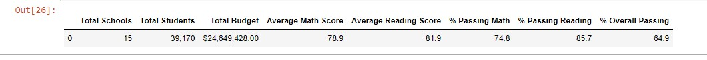

##School Level Metrics

Now that the overall district level metrics have been calculated, we are asked to move on to the school level metrics. These metrics will include the following for each school:

<ul>
<li>School name</li>
<li>School type</li>
<li>Total students</li>
<li>Total school budget</li>
<li>Per student budget</li>
<li>Average math score</li>
<li>Average reading score</li>
<li>% passing math</li>
<li>% passing reading</li>
<li>% overall passing</li>
</ul>

We will do the same analysis that we did for the school district metrics, but will group the data into buckets by utilizing the groupby method of Pandas. This will then help us produce the metric for each school in the data set. 

	# Calculate the average test scores.
	per_school_math = school_data_complete_df.groupby(["school_name"]).mean()["math_score"]
	per_school_reading = school_data_complete_df.groupby(["school_name"]).mean()["reading_score"]
	
	# Calculate the passing scores by creating a filtered DataFrame.
	per_school_passing_math = school_data_complete_df[(school_data_complete_df["math_score"] >= 70)]
	per_school_passing_reading = school_data_complete_df[(school_data_complete_df["reading_score"] >= 70)]
	
	# Calculate the number of students passing math and passing reading by school.
	per_school_passing_math = per_school_passing_math.groupby(["school_name"]).count()["student_name"]
	per_school_passing_reading = per_school_passing_reading.groupby(["school_name"]).count()["student_name"]
	
	# Calculate the percentage of passing math and reading scores per school.
	per_school_passing_math = per_school_passing_math / per_school_counts * 100
	per_school_passing_reading = per_school_passing_reading / per_school_counts * 100
	
	# Calculate the students who passed both reading and math.
	per_passing_math_reading = school_data_complete_df[(school_data_complete_df["reading_score"] >= 70)
	                                               & (school_data_complete_df["math_score"] >= 70)]
	
	# Calculate the number of students passing math and passing reading by school.
	per_passing_math_reading = per_passing_math_reading.groupby(["school_name"]).count()["student_name"]
	
	# Calculate the percentage of passing math and reading scores per school.
	per_overall_passing_percentage = per_passing_math_reading / per_school_counts * 100

 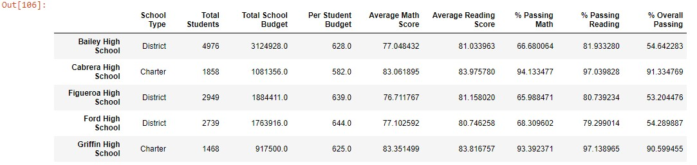

##Metrics by School Spending per Student

Maria said that the analysis was great. It has raised more questions with the school board.

The first question the school board would like researched is: How does school spending per student affect the school's average scores and passing percentages?  Maria tasks us with finding an answer to this question. This information will help the school board make decisions about the budget for the upcoming school year. Maria would like to see this data organized by spending ranges for the schools.

The first thing we need to do is establish our spending ranges for the analysis. After discussing this Maria and the school board, the bucket amounts are set at:
<ul>
<li>Less than 585</li>
<li>Between 585 and 629</li>
<li>Between 630 and 644</li>
<li>Between 645 and 674</li>
<li>Greater than 675</li>
</ul>

	# Establish the spending bins and group names.
	
	spending_bins = [0, 585, 630, 645, 675]
	group_names = ["<$584", "$585-629", "$630-644", "$645-675"]
	
	# Categorize spending based on the bins.
	per_school_summary_df["Spending Ranges (Per Student)"] = pd.cut(per_school_capita, spending_bins, labels=group_names)
	
	per_school_summary_df

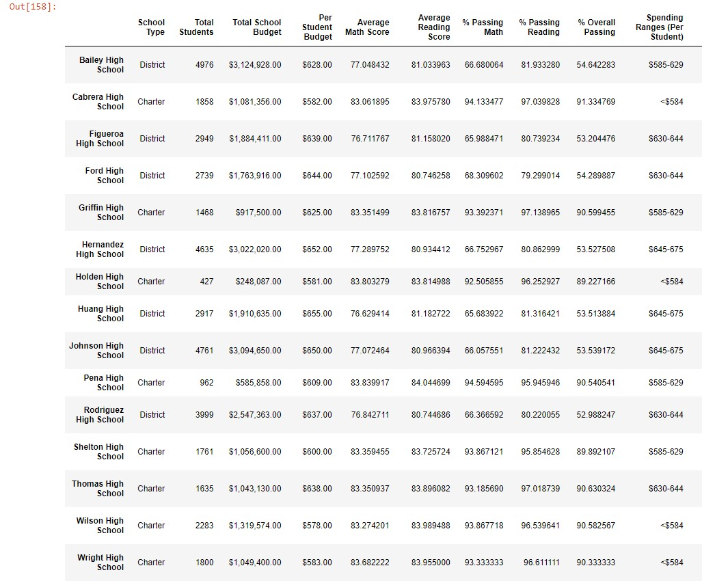

Now that we had our schools sorted by per student spending we could calculate the metrics asked for by the school board. We utilize the groupby method of the dataframe and calculated the following metrics for each set of schools in a given bucket of spending per student:
<ul>
<li>Average math score</li>
<li>Average reading score</li>
<li>% passing math</li>
<li>% passing reading</li>
<li>% overall passing</li>
</ul>

	# Calculate averages for the desired columns. 
	spending_math_scores = per_school_summary_df.groupby(["Spending Ranges (Per Student)"]).mean()["Average Math Score"]
	
	spending_reading_scores = per_school_summary_df.groupby(["Spending Ranges (Per Student)"]).mean()["Average Reading Score"]
	
	spending_passing_math = per_school_summary_df.groupby(["Spending Ranges (Per Student)"]).mean()["% Passing Math"]
	
	spending_passing_reading = per_school_summary_df.groupby(["Spending Ranges (Per Student)"]).mean()["% Passing Reading"]
	
	overall_passing_spending = per_school_summary_df.groupby(["Spending Ranges (Per Student)"]).mean()["% Overall Passing"]

After all of the metrics are calculated we assemble the results into a dataframe and produce the results for Maria and the school board.

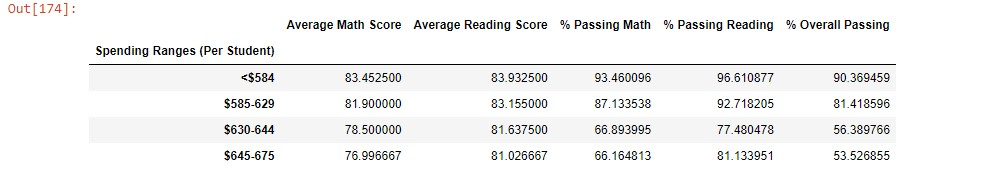

###Analysis Outcome

After looking at the data by spending per student it becomes obvious that spending more per student is not the answer. The data shows that the two highest spending buckets, 630-644 and >645, both did the worst on both the math and reading test, and on percentage of overall passing.

 
##Metrics by School Size

The next question the school board would like researched is: How does school size affect the school's average scores and passing percentages?  Maria tasks us with finding an answer to this question. This information will help the school board make decisions about building new facilities in the future. Maria would like to see this data organized by the student body size for the schools.

The first thing we need to do is establish our size ranges for the analysis. After discussing this Maria and the school board, the bucket amounts are set at:
<ul>
<li>Less than 1000 students</li>
<li>Between 1000 and 2000</li>
<li>Between 2000 and 5000</li>
<li>Greater than 5000</li>
</ul>

	# Establish the bins.
	size_bins = [0, 1000, 2000, 5000]
	group_names = ["Small (<1000)", "Medium (1000-2000)", "Large (2000-5000)"]
	
	# Categorize size based on the bins.
	per_school_summary_df["School Size"] = pd.cut(per_school_counts, size_bins, labels=group_names)
	
	per_school_summary_df

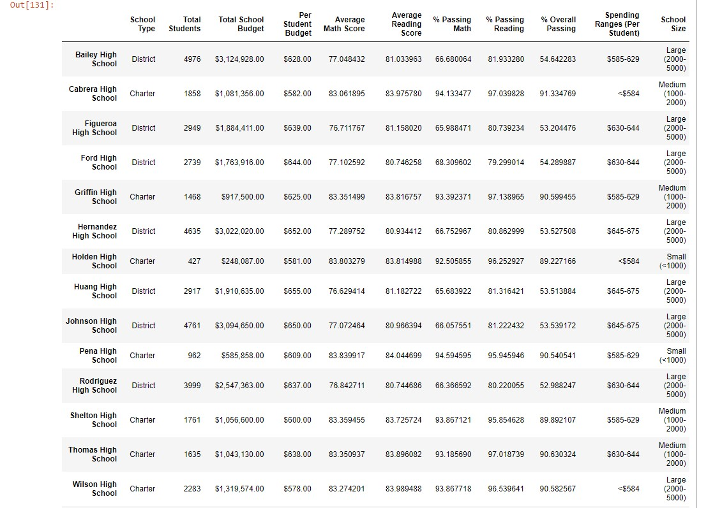

Now that we had our schools sorted by per student spending we could calculate the metrics asked for by the school board. We utilize the groupby method of the dataframe and calculated the following metrics for each set of schools in a given bucket of spending per student:
<ul>
<li>Average math score</li>
<li>Average reading score</li>
<li>% passing math</li>
<li>% passing reading</li>
<li>% overall passing</li>
</ul>

	# Calculate averages for the desired columns. 
	size_math_scores = per_school_summary_df.groupby(["School Size"]).mean()["Average Math Score"]
	
	size_reading_scores = per_school_summary_df.groupby(["School Size"]).mean()["Average Reading Score"]
	
	size_passing_math = per_school_summary_df.groupby(["School Size"]).mean()["% Passing Math"]
	
	size_passing_reading = per_school_summary_df.groupby(["School Size"]).mean()["% Passing Reading"]
	
	size_overall_passing = per_school_summary_df.groupby(["School Size"]).mean()["% Overall Passing"]

After all of the metrics are calculated we assemble the results into a dataframe and produce the results for Maria and the school board.

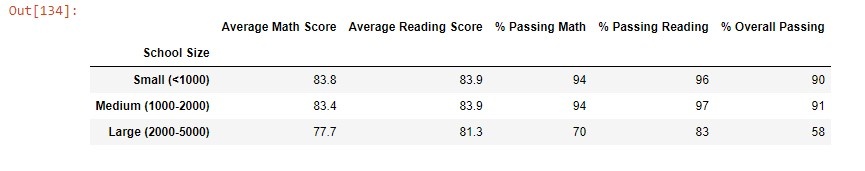

###Analysis Outcome

After looking at the data by student body size it becomes obvious that the larger the study body size the less likely the student is to pass. The data shows that the large school size, 2000-5000, did the worst on both the math and reading test, and on percentage of overall passing by large margins.

##Metrics by School Type

The final question the school board would like researched is: How does school type affect the school's average scores and passing percentages?  Maria tasks us with finding an answer to this question. Maria would like to see this data organized by the student body size for the schools.

The first thing we need to do is establish our types for the analysis. There are only two type of school in the districts so the buckets are defined as:
<ul>
<li>District</li>
<li>Charter</li>
</ul>

Since school type is in the original data set, we don't need to do any sorting or bucketing to prepare the data for analysis. We again utilize the groupby method of the dataframe and calculated the following metrics for each set of schools type:
<ul>
<li>Average math score</li>
<li>Average reading score</li>
<li>% passing math</li>
<li>% passing reading</li>
<li>% overall passing</li>
</ul>

	# Calculate averages for the desired columns. 
	# Calculate averages for the desired columns.
	type_math_scores = per_school_summary_df.groupby(["School Type"]).mean()["Average Math Score"]
	
	type_reading_scores = per_school_summary_df.groupby(["School Type"]).mean()["Average Reading Score"]
	
	type_passing_math = per_school_summary_df.groupby(["School Type"]).mean()["% Passing Math"]
	
	type_passing_reading = per_school_summary_df.groupby(["School Type"]).mean()["% Passing Reading"]
	
	type_overall_passing = per_school_summary_df.groupby(["School Type"]).mean()["% Overall Passing"]

After all of the metrics are calculated we assemble the results into a dataframe and produce the results for Maria and the school board.

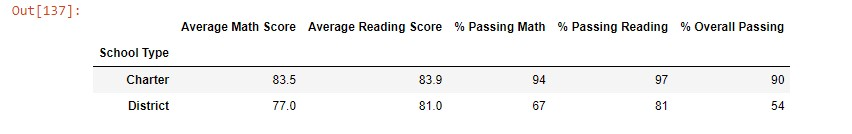

###Analysis Outcome

After looking at the data by school type it becomes obvious that students in public, or district, schools are far less likely to pass. The data shows that the district schools did the worst on both the math and reading test, and on percentage of overall passing by large margins.

